#Load data

::: {.cell}

```{.r .cell-code}
beaufort_scale <- readr::read_csv('https://raw.githubusercontent.com/rfordatascience/tidytuesday/main/data/2026/2026-04-14/beaufort_scale.csv')
```

::: {.cell-output .cell-output-stderr}

```
Rows: 13 Columns: 4
── Column specification ────────────────────────────────────────────────────────
Delimiter: ","
chr (1): wind_description
dbl (3): wind_speed_class, wind_speed_knots_min, wind_speed_knots_max

ℹ Use `spec()` to retrieve the full column specification for this data.
ℹ Specify the column types or set `show_col_types = FALSE` to quiet this message.
```


:::

```{.r .cell-code}
birds <- readr::read_csv('https://raw.githubusercontent.com/rfordatascience/tidytuesday/main/data/2026/2026-04-14/birds.csv')
```

::: {.cell-output .cell-output-stderr}

```
Warning: One or more parsing issues, call `problems()` on your data frame for details,
e.g.:
  dat <- vroom(...)
  problems(dat)
```


:::

::: {.cell-output .cell-output-stderr}

```
Rows: 49019 Columns: 26
── Column specification ────────────────────────────────────────────────────────
Delimiter: ","
chr  (6): species_common_name, species_scientific_name, species_abbreviation...
dbl  (9): bird_observation_id, record_id, count, n_feeding, n_sitting_on_wat...
lgl (11): sex, feeding, sitting_on_water, sitting_on_ice, sitting_on_ship, i...

ℹ Use `spec()` to retrieve the full column specification for this data.
ℹ Specify the column types or set `show_col_types = FALSE` to quiet this message.
```


:::

```{.r .cell-code}
sea_states <- readr::read_csv('https://raw.githubusercontent.com/rfordatascience/tidytuesday/main/data/2026/2026-04-14/sea_states.csv')
```

::: {.cell-output .cell-output-stderr}

```
Rows: 7 Columns: 4
── Column specification ────────────────────────────────────────────────────────
Delimiter: ","
chr (1): sea_state_description
dbl (3): sea_state_class, wave_meters_min, wave_meters_max

ℹ Use `spec()` to retrieve the full column specification for this data.
ℹ Specify the column types or set `show_col_types = FALSE` to quiet this message.
```


:::

```{.r .cell-code}
ships <- readr::read_csv('https://raw.githubusercontent.com/rfordatascience/tidytuesday/main/data/2026/2026-04-14/ships.csv')
```

::: {.cell-output .cell-output-stderr}

```
Rows: 12310 Columns: 21
── Column specification ────────────────────────────────────────────────────────
Delimiter: ","
chr   (7): hemisphere, activity, cloud_cover, precipitation, observer, censu...
dbl  (12): record_id, latitude, longitude, speed, direction, wind_speed_clas...
date  (1): date
time  (1): time

ℹ Use `spec()` to retrieve the full column specification for this data.
ℹ Specify the column types or set `show_col_types = FALSE` to quiet this message.
```


:::
:::


::: {.cell}

```{.r .cell-code}
library(tidyverse)
```

::: {.cell-output .cell-output-stderr}

```
── Attaching core tidyverse packages ──────────────────────── tidyverse 2.0.0 ──
✔ dplyr     1.2.0     ✔ readr     2.1.6
✔ forcats   1.0.1     ✔ stringr   1.6.0
✔ ggplot2   4.0.2     ✔ tibble    3.3.1
✔ lubridate 1.9.5     ✔ tidyr     1.3.2
✔ purrr     1.2.1     
── Conflicts ────────────────────────────────────────── tidyverse_conflicts() ──
✖ dplyr::filter() masks stats::filter()
✖ dplyr::lag()    masks stats::lag()
ℹ Use the conflicted package (<http://conflicted.r-lib.org/>) to force all conflicts to become errors
```


:::

```{.r .cell-code}
library(tidymodels)
```

::: {.cell-output .cell-output-stderr}

```
── Attaching packages ────────────────────────────────────── tidymodels 1.4.1 ──
✔ broom        1.0.12     ✔ rsample      1.3.2 
✔ dials        1.4.2      ✔ tailor       0.1.0 
✔ infer        1.1.0      ✔ tune         2.0.1 
✔ modeldata    1.5.1      ✔ workflows    1.3.0 
✔ parsnip      1.4.1      ✔ workflowsets 1.1.1 
✔ recipes      1.3.1      ✔ yardstick    1.3.2 
── Conflicts ───────────────────────────────────────── tidymodels_conflicts() ──
✖ scales::discard() masks purrr::discard()
✖ dplyr::filter()   masks stats::filter()
✖ recipes::fixed()  masks stringr::fixed()
✖ dplyr::lag()      masks stats::lag()
✖ yardstick::spec() masks readr::spec()
✖ recipes::step()   masks stats::step()
```


:::

```{.r .cell-code}
library(janitor)
```

::: {.cell-output .cell-output-stderr}

```

Attaching package: 'janitor'

The following objects are masked from 'package:stats':

    chisq.test, fisher.test
```


:::

```{.r .cell-code}
library(lubridate)
library(knitr)
library(scales)

tidymodels_prefer()
set.seed(1234)
```
:::


::: {.cell}

```{.r .cell-code}
list(
  beaufort_scale = glimpse(beaufort_scale),
  birds = glimpse(birds),
  sea_states = glimpse(sea_states),
  ships = glimpse(ships)
)
```

::: {.cell-output .cell-output-stdout}

```
Rows: 13
Columns: 4
$ wind_speed_class     <dbl> 0, 1, 2, 3, 4, 5, 6, 7, 8, 9, 10, 11, 12
$ wind_description     <chr> "calm", "light air", "light breeze", "gentle bree…
$ wind_speed_knots_min <dbl> 0, 1, 4, 7, 11, 17, 22, 28, 34, 41, 48, 56, 64
$ wind_speed_knots_max <dbl> 1, 3, 6, 10, 16, 21, 27, 33, 40, 47, 55, 63, NA
Rows: 49,019
Columns: 26
$ bird_observation_id     <dbl> 1, 2, 3, 4, 5, 6, 7, 8, 9, 10, 11, 12, 13, 14,…
$ record_id               <dbl> 1083001, 1083001, 1083001, 1083001, 1083001, 1…
$ species_common_name     <chr> "Royal / Wandering albatross", "Black-browed a…
$ species_scientific_name <chr> "Diomedea epomophora / sanfordi / antipodensis…
$ species_abbreviation    <chr> "DIOEPOSANANTEXU", "DIOIMPMEL", "DAPCAP", "PAC…
$ age                     <chr> NA, NA, NA, NA, NA, NA, NA, NA, NA, NA, NA, NA…
$ wan_plumage_phase       <chr> NA, NA, NA, NA, NA, NA, NA, NA, NA, NA, NA, NA…
$ plumage_phase           <chr> NA, NA, NA, NA, NA, NA, NA, NA, NA, NA, NA, NA…
$ sex                     <lgl> NA, NA, NA, NA, NA, NA, NA, NA, NA, NA, NA, NA…
$ count                   <dbl> 6, 2, 8, 2, 4, 10, 2, 18, 10, 2, 2, 2, 8, 1, 1…
$ n_feeding               <dbl> 0, 0, 0, 0, 0, 0, 0, NA, 0, 0, NA, NA, NA, 0, …
$ feeding                 <lgl> FALSE, FALSE, FALSE, FALSE, FALSE, FALSE, FALS…
$ n_sitting_on_water      <dbl> 0, 0, 0, 0, 0, 2, 0, NA, 0, 0, NA, NA, NA, 0, …
$ sitting_on_water        <lgl> FALSE, FALSE, FALSE, FALSE, FALSE, TRUE, FALSE…
$ n_sitting_on_ice        <dbl> 0, 0, 0, 0, 0, 0, 0, NA, 0, 0, NA, NA, NA, 0, …
$ sitting_on_ice          <lgl> FALSE, FALSE, FALSE, FALSE, FALSE, FALSE, FALS…
$ sitting_on_ship         <lgl> FALSE, FALSE, FALSE, FALSE, FALSE, FALSE, FALS…
$ in_hand                 <lgl> FALSE, FALSE, FALSE, FALSE, FALSE, FALSE, FALS…
$ n_flying_past           <dbl> 0, 0, 0, 0, 0, 0, 0, NA, 0, 0, NA, NA, NA, 0, …
$ flying_past             <lgl> FALSE, FALSE, FALSE, FALSE, FALSE, FALSE, FALS…
$ n_accompanying          <dbl> 6, 2, 8, 2, 4, 0, 0, NA, 0, 0, NA, NA, NA, 0, …
$ accompanying            <lgl> TRUE, TRUE, TRUE, TRUE, TRUE, FALSE, FALSE, TR…
$ n_following_ship        <dbl> 0, 0, 0, 0, 0, 8, 2, NA, 10, 2, NA, NA, NA, 1,…
$ following_ship          <lgl> FALSE, FALSE, FALSE, FALSE, FALSE, TRUE, TRUE,…
$ moulting                <lgl> NA, NA, NA, NA, NA, NA, NA, NA, NA, NA, NA, NA…
$ naturally_feeding       <lgl> FALSE, FALSE, FALSE, FALSE, FALSE, FALSE, FALS…
Rows: 7
Columns: 4
$ sea_state_class       <dbl> 0, 1, 2, 3, 4, 5, 6
$ sea_state_description <chr> "calm, glassy", "calm, rippled", "smooth", "slig…
$ wave_meters_min       <dbl> 0.0, 0.0, 0.1, 0.5, 1.3, 2.5, 4.0
$ wave_meters_max       <dbl> 0.0, 0.1, 0.5, 1.2, 2.5, 4.0, 6.0
Rows: 12,310
Columns: 21
$ record_id               <dbl> 1083001, 1084001, 1084002, 1084003, 1086001, 1…
$ date                    <date> 1975-10-15, 1975-11-03, 1975-11-04, 1975-11-0…
$ time                    <time> 14:00:00, 13:10:00, 14:20:00, 16:15:00, 12:30…
$ latitude                <dbl> -45.917, -35.533, -37.667, -40.000, -36.167, -…
$ longitude               <dbl> 165.400, 125.000, 132.250, 162.000, 174.917, 1…
$ hemisphere              <chr> "E", "E", "E", "E", "E", "E", "E", "E", "E", "…
$ activity                <chr> "steaming, sailing", "steaming, sailing", "ste…
$ speed                   <dbl> 15.0, 14.0, 14.5, 14.6, 15.0, 15.0, 15.0, 15.0…
$ direction               <dbl> NA, NA, NA, NA, NA, NA, NA, NA, NA, NA, NA, NA…
$ cloud_cover             <chr> "overcast", "partially cloudy", "overcast", "p…
$ precipitation           <chr> "showers", "none", "none", "squalls", "none", …
$ wind_speed_class        <dbl> 5, 4, 4, 4, 0, 3, 3, 2, 3, 2, 7, 4, 6, 6, 6, 6…
$ wind_direction          <dbl> NA, NA, NA, NA, NA, NA, NA, NA, NA, NA, NA, NA…
$ air_temperature         <dbl> NA, NA, NA, NA, NA, NA, NA, NA, NA, NA, NA, NA…
$ pressure                <dbl> NA, NA, NA, NA, NA, NA, NA, NA, NA, NA, NA, NA…
$ sea_state_class         <dbl> 5, 4, 4, 4, 1, 3, 3, 3, 4, 3, 5, 4, 5, 5, 5, 5…
$ sea_surface_temperature <dbl> NA, NA, NA, NA, NA, NA, NA, NA, NA, NA, NA, NA…
$ depth                   <dbl> NA, NA, NA, NA, NA, NA, NA, NA, NA, NA, NA, NA…
$ observer                <chr> "D. Jeffcock", "D. Jeffcock", "D. Jeffcock", "…
$ census_method           <chr> "full", "full", "full", "full", "full", "full"…
$ season                  <chr> "spring", "spring", "spring", "spring", "sprin…
```


:::

::: {.cell-output .cell-output-stdout}

```
$beaufort_scale
# A tibble: 13 × 4
   wind_speed_class wind_description wind_speed_knots_min wind_speed_knots_max
              <dbl> <chr>                           <dbl>                <dbl>
 1                0 calm                                0                    1
 2                1 light air                           1                    3
 3                2 light breeze                        4                    6
 4                3 gentle breeze                       7                   10
 5                4 moderate breeze                    11                   16
 6                5 fresh breeze                       17                   21
 7                6 strong breeze                      22                   27
 8                7 near gale                          28                   33
 9                8 gale                               34                   40
10                9 strong gale                        41                   47
11               10 storm                              48                   55
12               11 violent storm                      56                   63
13               12 hurricane                          64                   NA

$birds
# A tibble: 49,019 × 26
   bird_observation_id record_id species_common_name      species_scientific_n…¹
                 <dbl>     <dbl> <chr>                    <chr>                 
 1                   1   1083001 Royal / Wandering albat… Diomedea epomophora /…
 2                   2   1083001 Black-browed albatross … Diomedea impavida / m…
 3                   3   1083001 Cape petrel              Daption capense       
 4                   4   1083001 Fairy prion              Pachyptila turtur     
 5                   5   1083001 Sooty shearwater         Puffinus griseus      
 6                   6   1084001 Royal albatross sensu l… Diomedea epomophora /…
 7                   7   1084001 Black-browed albatross … Diomedea impavida / m…
 8                   8   1084001 Sooty shearwater         Puffinus griseus      
 9                   9   1084002 Royal albatross sensu l… Diomedea epomophora /…
10                  10   1084002 Black-browed albatross … Diomedea impavida / m…
# ℹ 49,009 more rows
# ℹ abbreviated name: ¹​species_scientific_name
# ℹ 22 more variables: species_abbreviation <chr>, age <chr>,
#   wan_plumage_phase <chr>, plumage_phase <chr>, sex <lgl>, count <dbl>,
#   n_feeding <dbl>, feeding <lgl>, n_sitting_on_water <dbl>,
#   sitting_on_water <lgl>, n_sitting_on_ice <dbl>, sitting_on_ice <lgl>,
#   sitting_on_ship <lgl>, in_hand <lgl>, n_flying_past <dbl>, …

$sea_states
# A tibble: 7 × 4
  sea_state_class sea_state_description wave_meters_min wave_meters_max
            <dbl> <chr>                           <dbl>           <dbl>
1               0 calm, glassy                      0               0  
2               1 calm, rippled                     0               0.1
3               2 smooth                            0.1             0.5
4               3 slight                            0.5             1.2
5               4 moderate                          1.3             2.5
6               5 rough                             2.5             4  
7               6 very rough                        4               6  

$ships
# A tibble: 12,310 × 21
   record_id date       time   latitude longitude hemisphere activity      speed
       <dbl> <date>     <time>    <dbl>     <dbl> <chr>      <chr>         <dbl>
 1   1083001 1975-10-15 14:00     -45.9      165. E          steaming, sa…  15  
 2   1084001 1975-11-03 13:10     -35.5      125  E          steaming, sa…  14  
 3   1084002 1975-11-04 14:20     -37.7      132. E          steaming, sa…  14.5
 4   1084003 1975-11-08 16:15     -40        162  E          steaming, sa…  14.6
 5   1086001 1975-11-16 12:30     -36.2      175. E          steaming, sa…  15  
 6   1086002 1975-11-16 15:30     -35.4      175. E          steaming, sa…  15  
 7   1086003 1975-11-17 14:30     -35.2      168  E          steaming, sa…  15  
 8   1086004 1975-11-17 16:30     -35.3      167. E          steaming, sa…  15  
 9   1086005 1975-11-18 14:30     -36.5      161  E          steaming, sa…  15  
10   1086006 1975-11-18 16:30     -36.3      160. E          steaming, sa…  15  
# ℹ 12,300 more rows
# ℹ 13 more variables: direction <dbl>, cloud_cover <chr>, precipitation <chr>,
#   wind_speed_class <dbl>, wind_direction <dbl>, air_temperature <dbl>,
#   pressure <dbl>, sea_state_class <dbl>, sea_surface_temperature <dbl>,
#   depth <dbl>, observer <chr>, census_method <chr>, season <chr>
```


:::
:::


::: {.cell}

```{.r .cell-code}
tibble(
  dataset = c("beaufort_scale", "birds", "sea_states", "ships"),
  n_rows = c(nrow(beaufort_scale), nrow(birds), nrow(sea_states), nrow(ships)),
  n_cols = c(ncol(beaufort_scale), ncol(birds), ncol(sea_states), ncol(ships))
) %>%
  kable()
```

::: {.cell-output-display}


|dataset        | n_rows| n_cols|
|:--------------|------:|------:|
|beaufort_scale |     13|      4|
|birds          |  49019|     26|
|sea_states     |      7|      4|
|ships          |  12310|     21|


:::
:::


# Cleaning and wrangling 

::: {.cell}

```{.r .cell-code}
beaufort_scale2 <- beaufort_scale %>%
  mutate(
    wind_speed_mid_knots = case_when(
      is.na(wind_speed_knots_max) ~ wind_speed_knots_min,
      TRUE ~ (wind_speed_knots_min + wind_speed_knots_max) / 2
    )
  )

sea_states2 <- sea_states %>%
  mutate(
    wave_height_mid_m = (wave_meters_min + wave_meters_max) / 2
  )

# Bird observations

birds_clean <- birds %>%
  clean_names() %>%
  mutate(
    # 99999 means estimated >100,000; treat as missing for modeling
    count = na_if(count, 99999),
    n_feeding = na_if(n_feeding, 99999),
    n_flying_past = na_if(n_flying_past, 99999),
    species_present = !is.na(species_common_name)
  )

bird_record <- birds_clean %>%
  group_by(record_id) %>%
  summarise(
    total_birds = sum(count, na.rm = TRUE),
    n_species = n_distinct(species_scientific_name, na.rm = TRUE),
    any_birds = any(species_present),
    n_obs_rows = n(),
    n_feeding_total = sum(n_feeding, na.rm = TRUE),
    n_flying_past_total = sum(n_flying_past, na.rm = TRUE),
    prop_obs_feeding = mean(feeding, na.rm = TRUE),
    prop_obs_flying_past = mean(flying_past, na.rm = TRUE),
    prop_obs_following_ship = mean(following_ship, na.rm = TRUE),
    .groups = "drop"
  ) %>%
  mutate(
    total_birds = if_else(!any_birds, 0, total_birds),
    n_species = if_else(!any_birds, 0L, n_species)
  )

# Clean ship data 
ships_clean <- ships %>%
  clean_names() %>%
  mutate(
    date = as.Date(date),
    month = month(date, label = TRUE, abbr = TRUE),
    year = year(date),
    census_method = fct_drop(census_method),
    season = fct_drop(season),
    cloud_cover = fct_drop(cloud_cover),
    precipitation = fct_drop(precipitation),
    activity = fct_drop(activity),
    observer = fct_drop(observer),
    hemisphere = fct_drop(hemisphere)
  ) %>%
  left_join(beaufort_scale2, by = "wind_speed_class") %>%
  left_join(sea_states2, by = "sea_state_class")

analysis_df <- ships_clean %>%
  left_join(bird_record, by = "record_id") %>%
  mutate(
    total_birds = replace_na(total_birds, 0),
    n_species = replace_na(n_species, 0L),
    any_birds = replace_na(any_birds, FALSE),
    n_obs_rows = replace_na(n_obs_rows, 0L),
    n_feeding_total = replace_na(n_feeding_total, 0),
    n_flying_past_total = replace_na(n_flying_past_total, 0),
    prop_obs_feeding = replace_na(prop_obs_feeding, 0),
    prop_obs_flying_past = replace_na(prop_obs_flying_past, 0),
    prop_obs_following_ship = replace_na(prop_obs_following_ship, 0),
    log_total_birds = log1p(total_birds)
  )

#Selecting variables

model_df <- analysis_df %>%
  filter(census_method == "full") %>%
  select(
    record_id,
    log_total_birds,
    total_birds,
    n_species,
    speed,
    direction,
    latitude,
    longitude,
    activity,
    cloud_cover,
    precipitation,
    wind_speed_class,
    wind_speed_mid_knots,
    wind_description,
    wind_direction,
    air_temperature,
    pressure,
    sea_state_class,
    sea_state_description,
    wave_height_mid_m,
    sea_surface_temperature,
    depth,
    observer,
    season,
    month,
    year
  ) %>%
  mutate(across(where(is.character), as.factor))
  
skim_summary <- tibble(
  rows = nrow(model_df),
  cols = ncol(model_df),
  outcome_missing = sum(is.na(model_df$log_total_birds))
)

skim_summary %>% kable()
```

::: {.cell-output-display}


|  rows| cols| outcome_missing|
|-----:|----:|---------------:|
| 12111|   26|               0|


:::
:::


# Exploratory analysis 

::: {.cell}

```{.r .cell-code}
# Outcome distribution 
ggplot(model_df, aes(x = total_birds)) +
  geom_histogram(bins = 40) +
  scale_x_continuous(labels = comma) +
  labs(
    title = "Distribution of total birds observed per full census",
    x = "Total birds",
    y = "Count of ship records"
  )
```

::: {.cell-output-display}
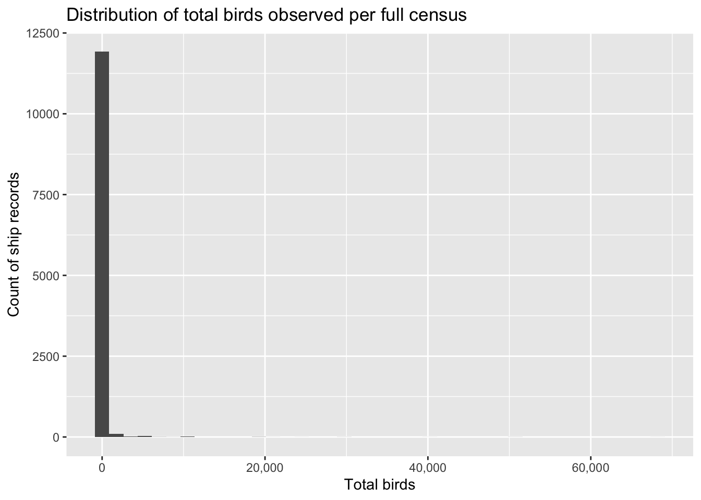{width=672}
:::

```{.r .cell-code}
# Activities that have higher bird counts
model_df %>%
  group_by(activity) %>%
  summarise(
    n = n(),
    mean_birds = mean(total_birds, na.rm = TRUE),
    median_birds = median(total_birds, na.rm = TRUE),
    .groups = "drop"
  ) %>%
  arrange(desc(mean_birds)) %>%
  kable(digits = 2)
```

::: {.cell-output-display}


|activity           |     n| mean_birds| median_birds|
|:------------------|-----:|----------:|------------:|
|trawling           |    49|     606.31|           31|
|steaming, sailing  | 11414|     109.03|            8|
|stationary         |   545|      88.53|           18|
|oceanography       |    59|      37.80|           21|
|line fishing       |    36|      14.44|           10|
|flying helicopters |     1|      12.00|           12|
|potting            |     7|       8.86|            7|


:::

```{.r .cell-code}
# Seasons that have higher bird counts
ggplot(model_df, aes(x = season, y = log_total_birds)) +
  geom_boxplot() +
  labs(
    title = "Bird abundance varies by season",
    x = "Season",
    y = "log(1 + total birds)"
  )
```

::: {.cell-output-display}
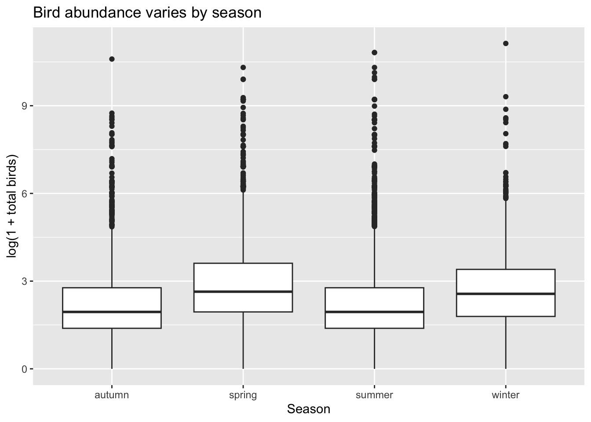{width=672}
:::

```{.r .cell-code}
# Enviormental conditions (wind)

ggplot(model_df, aes(x = wind_speed_mid_knots, y = log_total_birds)) +
  geom_point(alpha = 0.25) +
  geom_smooth(method = "loess", se = TRUE) +
  labs(
    title = "Bird abundance vs wind speed",
    x = "Approximate wind speed (knots)",
    y = "log(1 + total birds)"
  )
```

::: {.cell-output .cell-output-stderr}

```
`geom_smooth()` using formula = 'y ~ x'
```


:::

::: {.cell-output .cell-output-stderr}

```
Warning: Removed 4681 rows containing non-finite outside the scale range
(`stat_smooth()`).
```


:::

::: {.cell-output .cell-output-stderr}

```
Warning: Removed 4681 rows containing missing values or values outside the scale range
(`geom_point()`).
```


:::

::: {.cell-output-display}
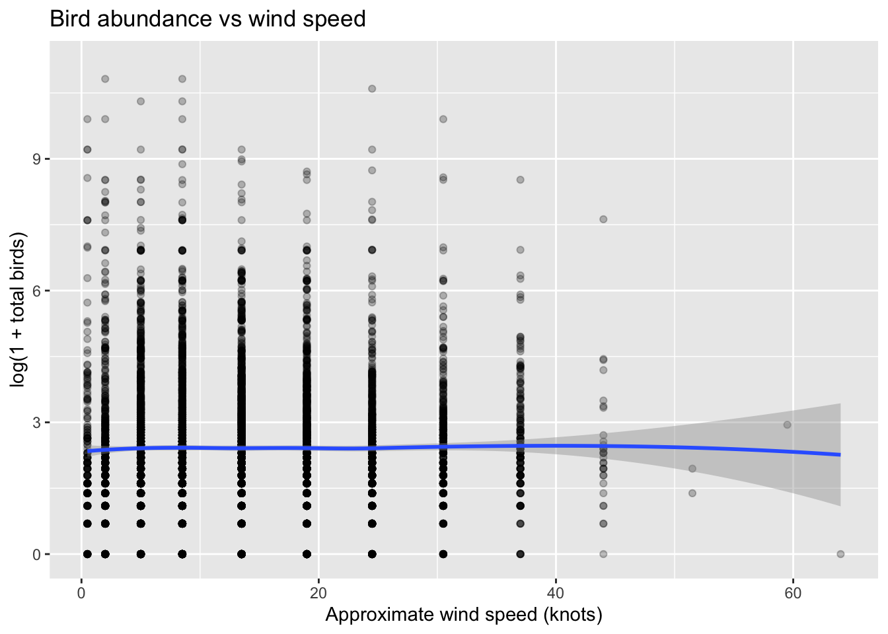{width=672}
:::

```{.r .cell-code}
# Enviormental conditions (wave)

ggplot(model_df, aes(x = wave_height_mid_m, y = log_total_birds)) +
  geom_point(alpha = 0.25) +
  geom_smooth(method = "loess", se = TRUE) +
  labs(
    title = "Bird abundance vs wave height",
    x = "Approximate wave height (m)",
    y = "log(1 + total birds)"
  )
```

::: {.cell-output .cell-output-stderr}

```
`geom_smooth()` using formula = 'y ~ x'
```


:::

::: {.cell-output .cell-output-stderr}

```
Warning: Removed 4743 rows containing non-finite outside the scale range
(`stat_smooth()`).
```


:::

::: {.cell-output .cell-output-stderr}

```
Warning in simpleLoess(y, x, w, span, degree = degree, parametric = parametric,
: pseudoinverse used at 1.9
```


:::

::: {.cell-output .cell-output-stderr}

```
Warning in simpleLoess(y, x, w, span, degree = degree, parametric = parametric,
: neighborhood radius 1.35
```


:::

::: {.cell-output .cell-output-stderr}

```
Warning in simpleLoess(y, x, w, span, degree = degree, parametric = parametric,
: reciprocal condition number 3.9218e-15
```


:::

::: {.cell-output .cell-output-stderr}

```
Warning in predLoess(object$y, object$x, newx = if (is.null(newdata)) object$x
else if (is.data.frame(newdata))
as.matrix(model.frame(delete.response(terms(object)), : pseudoinverse used at
1.9
```


:::

::: {.cell-output .cell-output-stderr}

```
Warning in predLoess(object$y, object$x, newx = if (is.null(newdata)) object$x
else if (is.data.frame(newdata))
as.matrix(model.frame(delete.response(terms(object)), : neighborhood radius
1.35
```


:::

::: {.cell-output .cell-output-stderr}

```
Warning in predLoess(object$y, object$x, newx = if (is.null(newdata)) object$x
else if (is.data.frame(newdata))
as.matrix(model.frame(delete.response(terms(object)), : reciprocal condition
number 3.9218e-15
```


:::

::: {.cell-output .cell-output-stderr}

```
Warning: Removed 4743 rows containing missing values or values outside the scale range
(`geom_point()`).
```


:::

::: {.cell-output-display}
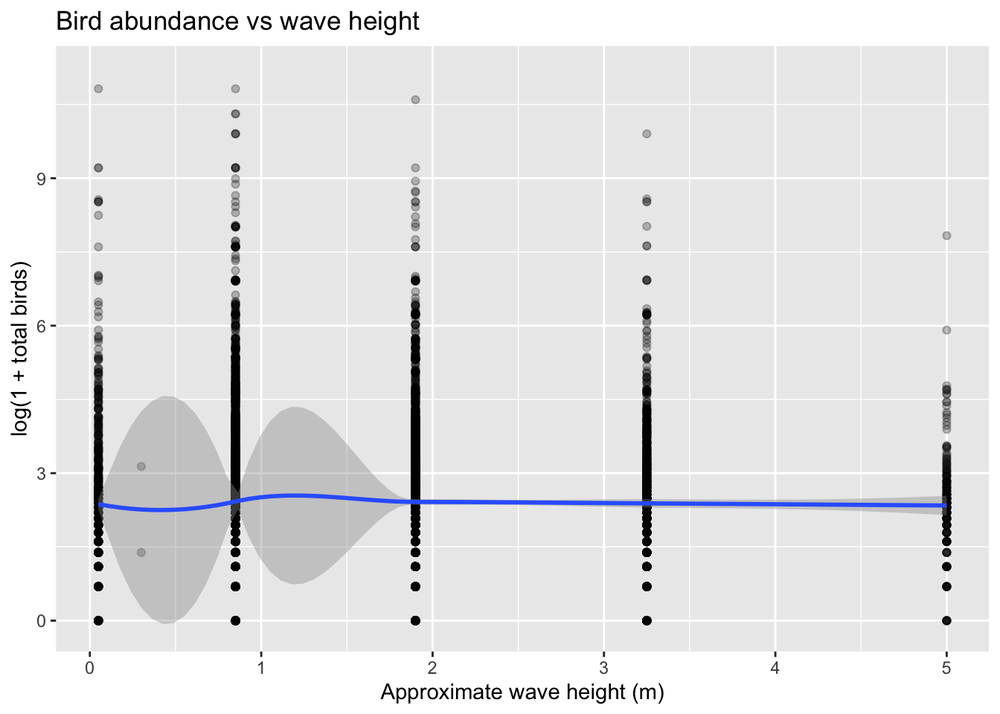{width=672}
:::

```{.r .cell-code}
# Missing variables 
model_df %>%
  summarise(across(everything(), ~mean(is.na(.)))) %>%
  pivot_longer(everything(), names_to = "variable", values_to = "prop_missing") %>%
  arrange(desc(prop_missing)) %>%
  slice_head(n = 15) %>%
  mutate(prop_missing = percent(prop_missing, accuracy = 0.1)) %>%
  kable()
```

::: {.cell-output-display}


|variable                |prop_missing |
|:-----------------------|:------------|
|depth                   |99.0%        |
|sea_surface_temperature |94.4%        |
|pressure                |93.6%        |
|air_temperature         |91.5%        |
|direction               |89.8%        |
|wind_direction          |89.5%        |
|precipitation           |39.6%        |
|cloud_cover             |39.5%        |
|sea_state_class         |39.2%        |
|sea_state_description   |39.2%        |
|wave_height_mid_m       |39.2%        |
|wind_speed_class        |38.7%        |
|wind_speed_mid_knots    |38.7%        |
|wind_description        |38.7%        |
|speed                   |36.9%        |


:::
:::


My scientific question is "How well enviornmental conditions (windm current, season) and ship activity predict seabird abundance during an observation period?"

I hypothesize that wind, current, season, and ship activity will help explain some of the variation. 

# Spliting test and train data

::: {.cell}

```{.r .cell-code}
set.seed(1234)
data_split <- initial_split(model_df, prop = 0.80)

train_data <- training(data_split)
test_data  <- testing(data_split)

nrow(train_data)
```

::: {.cell-output .cell-output-stdout}

```
[1] 9688
```


:::

```{.r .cell-code}
nrow(test_data)
```

::: {.cell-output .cell-output-stdout}

```
[1] 2423
```


:::
:::


# Recipe and CV setup

::: {.cell}

```{.r .cell-code}
bird_recipe <- recipe(log_total_birds ~ ., data = train_data) %>%
  update_role(record_id, total_birds, n_species, new_role = "id") %>%
  step_rm(year) %>%
  step_novel(all_nominal_predictors()) %>%
  step_unknown(all_nominal_predictors()) %>%
  step_other(observer, threshold = 0.02) %>%
  step_impute_median(all_numeric_predictors()) %>%
  step_impute_mode(all_nominal_predictors()) %>%
  step_dummy(all_nominal_predictors()) %>%
  step_zv(all_predictors()) %>%
  step_normalize(all_numeric_predictors())

bird_recipe
```

::: {.cell-output .cell-output-stderr}

```

```


:::

::: {.cell-output .cell-output-stderr}

```
── Recipe ──────────────────────────────────────────────────────────────────────
```


:::

::: {.cell-output .cell-output-stderr}

```

```


:::

::: {.cell-output .cell-output-stderr}

```
── Inputs 
```


:::

::: {.cell-output .cell-output-stderr}

```
Number of variables by role
```


:::

::: {.cell-output .cell-output-stderr}

```
outcome:    1
predictor: 22
id:         3
```


:::

::: {.cell-output .cell-output-stderr}

```

```


:::

::: {.cell-output .cell-output-stderr}

```
── Operations 
```


:::

::: {.cell-output .cell-output-stderr}

```
• Variables removed: year
```


:::

::: {.cell-output .cell-output-stderr}

```
• Novel factor level assignment for: all_nominal_predictors()
```


:::

::: {.cell-output .cell-output-stderr}

```
• Unknown factor level assignment for: all_nominal_predictors()
```


:::

::: {.cell-output .cell-output-stderr}

```
• Collapsing factor levels for: observer
```


:::

::: {.cell-output .cell-output-stderr}

```
• Median imputation for: all_numeric_predictors()
```


:::

::: {.cell-output .cell-output-stderr}

```
• Mode imputation for: all_nominal_predictors()
```


:::

::: {.cell-output .cell-output-stderr}

```
• Dummy variables from: all_nominal_predictors()
```


:::

::: {.cell-output .cell-output-stderr}

```
• Zero variance filter on: all_predictors()
```


:::

::: {.cell-output .cell-output-stderr}

```
• Centering and scaling for: all_numeric_predictors()
```


:::

```{.r .cell-code}
#cv setup

set.seed(1234)
cv_folds <- vfold_cv(train_data, v = 5)

reg_metrics <- metric_set(rmse, rsq, mae)
```
:::


# Models 

::: {.cell}

```{.r .cell-code}
lm_spec <- linear_reg() %>%
  set_engine("lm")

rf_spec <- rand_forest(
  trees = 1000,
  mtry = tune(),
  min_n = tune()
) %>%
  set_engine("ranger") %>%
  set_mode("regression")

tree_spec <- decision_tree(
  cost_complexity = tune(),
  tree_depth = tune(),
  min_n = tune()
) %>%
  set_engine("rpart") %>%
  set_mode("regression")

# workflows

lm_wf <- workflow() %>%
  add_recipe(bird_recipe) %>%
  add_model(lm_spec)

rf_wf <- workflow() %>%
  add_recipe(bird_recipe) %>%
  add_model(rf_spec)

tree_wf <- workflow() %>%
  add_recipe(bird_recipe) %>%
  add_model(tree_spec)
```
:::


# Model 1: linear regression 

::: {.cell}

```{.r .cell-code}
set.seed(1234)
lm_res <- fit_resamples(
  lm_wf,
  resamples = cv_folds,
  metrics = reg_metrics,
  control = control_resamples(save_pred = TRUE)
)
```

::: {.cell-output .cell-output-stderr}

```
→ A | warning: prediction from rank-deficient fit; consider predict(., rankdeficient="NA")
```


:::

::: {.cell-output .cell-output-stderr}

```
There were issues with some computations   A: x1
```


:::

::: {.cell-output .cell-output-stderr}

```
There were issues with some computations   A: x5
```


:::

::: {.cell-output .cell-output-stderr}

```

```


:::

```{.r .cell-code}
collect_metrics(lm_res)
```

::: {.cell-output .cell-output-stdout}

```
# A tibble: 3 × 6
  .metric .estimator  mean     n std_err .config        
  <chr>   <chr>      <dbl> <int>   <dbl> <chr>          
1 mae     standard   1.02      5 0.00876 pre0_mod0_post0
2 rmse    standard   1.39      5 0.00974 pre0_mod0_post0
3 rsq     standard   0.120     5 0.00324 pre0_mod0_post0
```


:::
:::


# Model 2: random forest 

::: {.cell}

```{.r .cell-code}
set.seed(1234)
rf_grid <- grid_regular(
  mtry(range = c(3L, 15L)),
  min_n(range = c(2L, 20L)),
  levels = 4
)

rf_res <- tune_grid(
  rf_wf,
  resamples = cv_folds,
  grid = rf_grid,
  metrics = reg_metrics,
  control = control_grid(save_pred = TRUE)
)

collect_metrics(rf_res)
```

::: {.cell-output .cell-output-stdout}

```
# A tibble: 48 × 8
    mtry min_n .metric .estimator  mean     n std_err .config         
   <int> <int> <chr>   <chr>      <dbl> <int>   <dbl> <chr>           
 1     3     2 mae     standard   0.957     5 0.00735 pre0_mod01_post0
 2     3     2 rmse    standard   1.33      5 0.00959 pre0_mod01_post0
 3     3     2 rsq     standard   0.222     5 0.0105  pre0_mod01_post0
 4     3     8 mae     standard   0.959     5 0.00714 pre0_mod02_post0
 5     3     8 rmse    standard   1.33      5 0.00931 pre0_mod02_post0
 6     3     8 rsq     standard   0.220     5 0.0100  pre0_mod02_post0
 7     3    14 mae     standard   0.962     5 0.00703 pre0_mod03_post0
 8     3    14 rmse    standard   1.33      5 0.00945 pre0_mod03_post0
 9     3    14 rsq     standard   0.216     5 0.00994 pre0_mod03_post0
10     3    20 mae     standard   0.964     5 0.00720 pre0_mod04_post0
# ℹ 38 more rows
```


:::
:::


# Model 3: boosted trees

::: {.cell}

```{.r .cell-code}
set.seed(1234)
tree_grid <- grid_regular(
  cost_complexity(),
  tree_depth(),
  min_n(),
  levels = 4
)

tree_res <- tune_grid(
  tree_wf,
  resamples = cv_folds,
  grid = tree_grid,
  metrics = reg_metrics,
  control = control_grid(save_pred = TRUE)
)
```

::: {.cell-output .cell-output-stderr}

```
→ A | warning: A correlation computation is required, but `estimate` is constant and has 0
               standard deviation, resulting in a divide by 0 error. `NA` will be returned.
```


:::

::: {.cell-output .cell-output-stderr}

```
There were issues with some computations   A: x16
```


:::

::: {.cell-output .cell-output-stderr}

```
There were issues with some computations   A: x32
```


:::

::: {.cell-output .cell-output-stderr}

```
There were issues with some computations   A: x48
```


:::

::: {.cell-output .cell-output-stderr}

```
There were issues with some computations   A: x64
```


:::

::: {.cell-output .cell-output-stderr}

```
There were issues with some computations   A: x80
There were issues with some computations   A: x80
```


:::

::: {.cell-output .cell-output-stderr}

```

```


:::

```{.r .cell-code}
collect_metrics(tree_res)
```

::: {.cell-output .cell-output-stdout}

```
# A tibble: 192 × 9
   cost_complexity tree_depth min_n .metric .estimator   mean     n std_err
             <dbl>      <int> <int> <chr>   <chr>       <dbl> <int>   <dbl>
 1    0.0000000001          1     2 mae     standard   1.08       5 0.00723
 2    0.0000000001          1     2 rmse    standard   1.45       5 0.00985
 3    0.0000000001          1     2 rsq     standard   0.0425     5 0.00284
 4    0.0000000001          1    14 mae     standard   1.08       5 0.00723
 5    0.0000000001          1    14 rmse    standard   1.45       5 0.00985
 6    0.0000000001          1    14 rsq     standard   0.0425     5 0.00284
 7    0.0000000001          1    27 mae     standard   1.08       5 0.00723
 8    0.0000000001          1    27 rmse    standard   1.45       5 0.00985
 9    0.0000000001          1    27 rsq     standard   0.0425     5 0.00284
10    0.0000000001          1    40 mae     standard   1.08       5 0.00723
# ℹ 182 more rows
# ℹ 1 more variable: .config <chr>
```


:::
:::


# Compare preformance of models 

::: {.cell}

```{.r .cell-code}
lm_metrics <- collect_metrics(lm_res) %>%
  mutate(model = "Linear regression")

rf_metrics <- show_best(rf_res, metric = "rmse", n = 5) %>%
  slice(1) %>%
  mutate(model = "Random forest")

tree_metrics <- show_best(tree_res, metric = "rmse", n = 5) %>%
  slice(1) %>%
  mutate(model = "Decision tree")

bind_rows(
  lm_metrics %>% select(model, .metric, mean, std_err),
  rf_metrics %>% select(model, .metric, mean, std_err),
  tree_metrics %>% select(model, .metric, mean, std_err)
) %>%
  arrange(.metric, mean) %>%
  kable(digits = 3)
```

::: {.cell-output-display}


|model             |.metric |  mean| std_err|
|:-----------------|:-------|-----:|-------:|
|Linear regression |mae     | 1.015|   0.009|
|Random forest     |rmse    | 1.177|   0.011|
|Decision tree     |rmse    | 1.263|   0.012|
|Linear regression |rmse    | 1.388|   0.010|
|Linear regression |rsq     | 0.120|   0.003|


:::

```{.r .cell-code}
autoplot(rf_res) +
  labs(title = "Random forest tuning results")
```

::: {.cell-output-display}
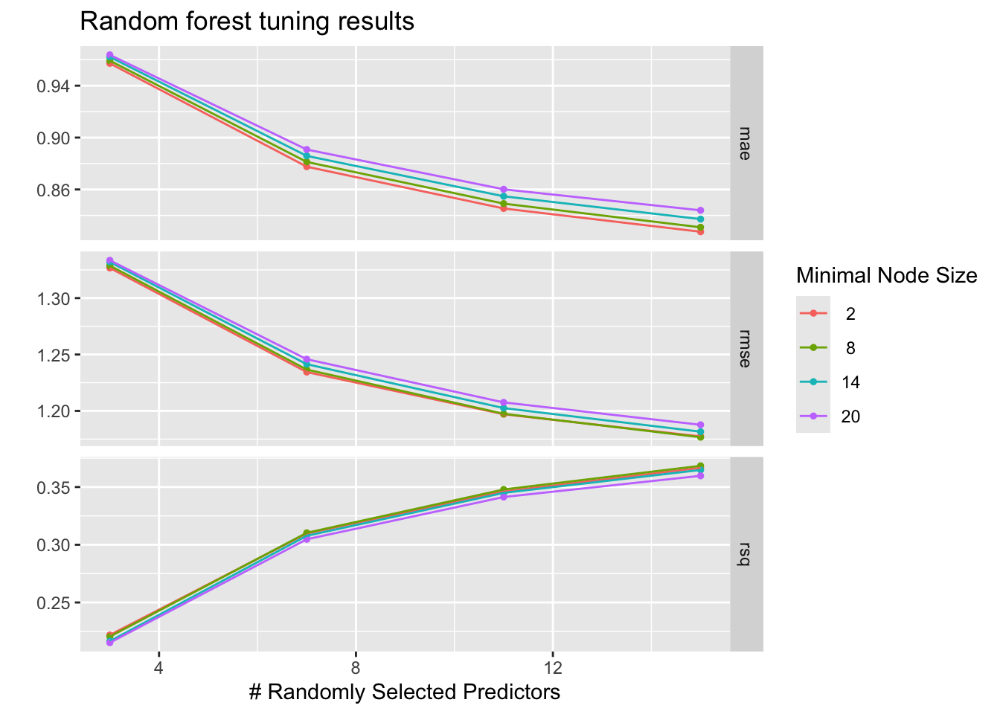{width=672}
:::

```{.r .cell-code}
autoplot(tree_res) +
  labs(title = "Boosted tree tuning results")
```

::: {.cell-output-display}
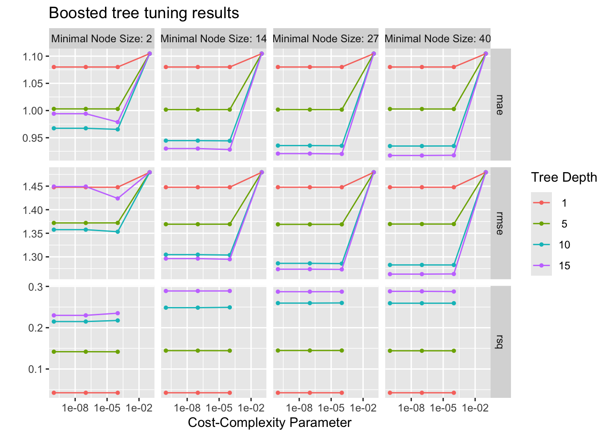{width=672}
:::
:::


# CV predictions 

::: {.cell}

```{.r .cell-code}
# linear regression model
lm_cv_preds <- collect_predictions(lm_res) %>%
  mutate(model = "Linear regression")

ggplot(lm_cv_preds, aes(x = .pred, y = log_total_birds - .pred)) +
  geom_point(alpha = 0.25) +
  geom_hline(yintercept = 0, linetype = 2) +
  labs(
    title = "Linear regression CV residuals",
    x = "Predicted log bird count",
    y = "Residual"
  )
```

::: {.cell-output-display}
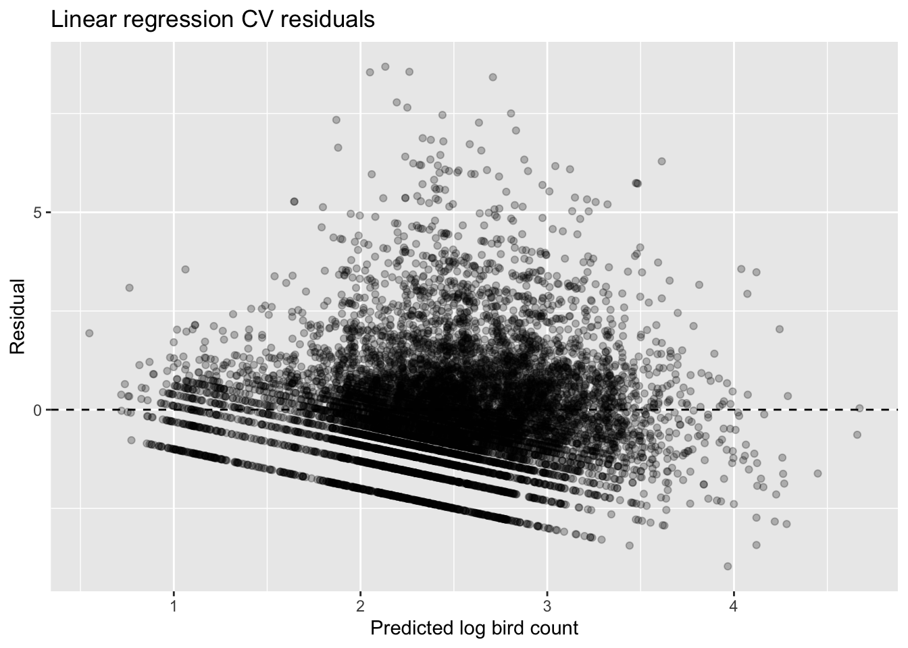{width=672}
:::

```{.r .cell-code}
# random forest model

best_rf <- select_best(rf_res, metric = "rmse")

rf_final_wf <- finalize_workflow(rf_wf, best_rf)

rf_cv_preds <- fit_resamples(
  rf_final_wf,
  resamples = cv_folds,
  metrics = reg_metrics,
  control = control_resamples(save_pred = TRUE)
) %>%
  collect_predictions()

ggplot(rf_cv_preds, aes(x = .pred, y = log_total_birds - .pred)) +
  geom_point(alpha = 0.25) +
  geom_hline(yintercept = 0, linetype = 2) +
  labs(
    title = "Random forest CV residuals",
    x = "Predicted log bird count",
    y = "Residual"
  )
```

::: {.cell-output-display}
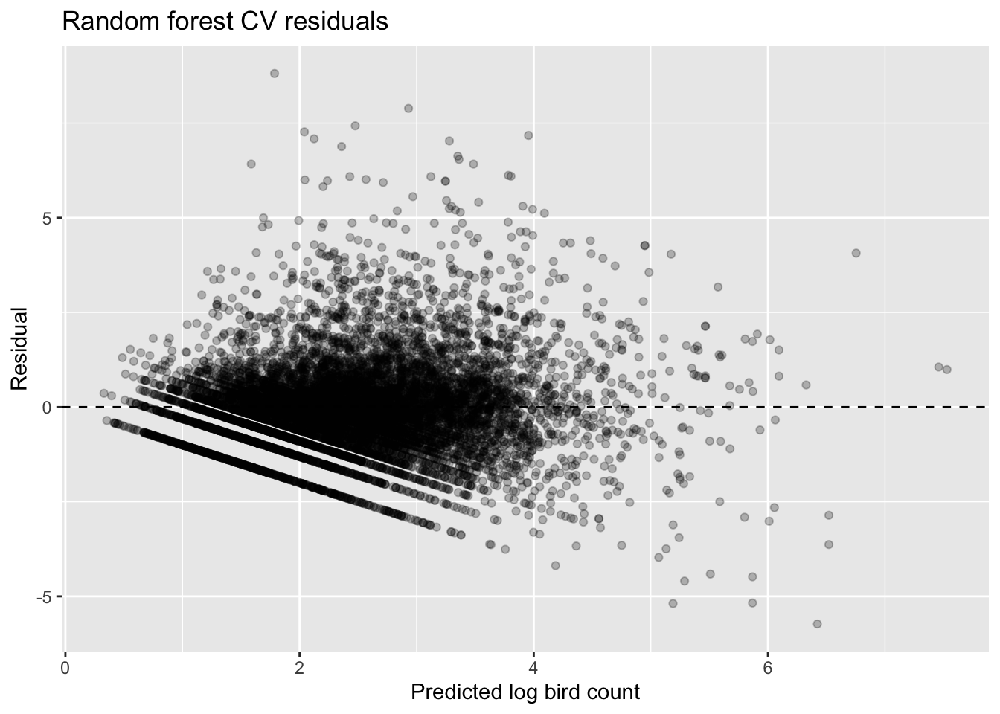{width=672}
:::

```{.r .cell-code}
# boosted trees model

best_tree <- select_best(tree_res, metric = "rmse")

tree_final_wf <- finalize_workflow(tree_wf, best_tree)

tree_cv_preds <- fit_resamples(
  tree_final_wf,
  resamples = cv_folds,
  metrics = reg_metrics,
  control = control_resamples(save_pred = TRUE)
) %>%
  collect_predictions()

ggplot(tree_cv_preds, aes(x = .pred, y = log_total_birds - .pred)) +
  geom_point(alpha = 0.25) +
  geom_hline(yintercept = 0, linetype = 2) +
  labs(
    title = "Boosted tree CV residuals",
    x = "Predicted log bird count",
    y = "Residual"
  )
```

::: {.cell-output-display}
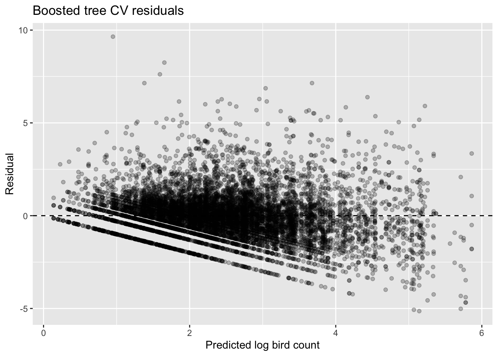{width=672}
:::
:::


I chose the random forest as the best overall model because it preformed better than the other models in both predictive accuracy and ability to show realtionships. The linear regression model showed weak performance (R² ≈ 0.12), indicating that it failed to explain much of the variation in seabird abundance. The decision tree also performed poorly, with higher error and low explanatory power. The random forest achieved the lowest RMSE and highest R², explaining approximately 39% of the variation in bird abundance on the test set .

# Overall best model 

::: {.cell}

```{.r .cell-code}
best_rf <- select_best(rf_res, metric = "rmse")
rf_final_wf <- finalize_workflow(rf_wf, best_rf)

# Fit final model on training data only
rf_final_fit <- fit(rf_final_wf, data = train_data)

test_preds <- predict(rf_final_fit, new_data = test_data) %>%
  bind_cols(test_data) %>%
  mutate(residual = log_total_birds - .pred)

metric_set(rmse, rsq, mae)(test_preds, truth = log_total_birds, estimate = .pred) %>%
  kable(digits = 3)
```

::: {.cell-output-display}


|.metric |.estimator | .estimate|
|:-------|:----------|---------:|
|rmse    |standard   |     1.172|
|rsq     |standard   |     0.388|
|mae     |standard   |     0.831|


:::

```{.r .cell-code}
# Predicted vs observed
ggplot(test_preds, aes(x = .pred, y = log_total_birds)) +
  geom_point(alpha = 0.3) +
  geom_abline(intercept = 0, slope = 1, linetype = 2) +
  labs(
    title = "Final model performance on test data",
    x = "Predicted log bird count",
    y = "Observed log bird count"
  )
```

::: {.cell-output-display}
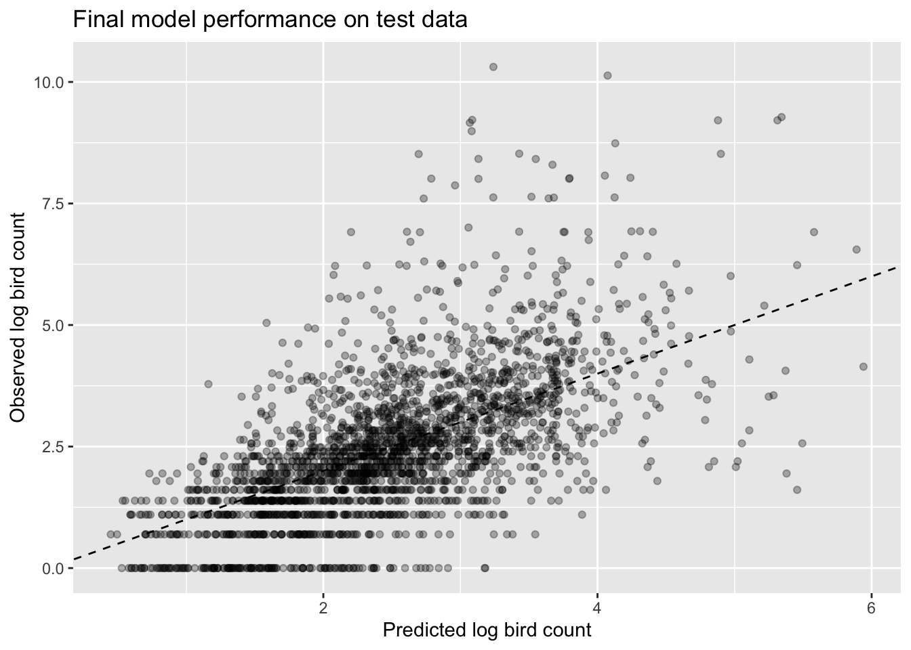{width=672}
:::

```{.r .cell-code}
# Residual plot
ggplot(test_preds, aes(x = .pred, y = residual)) +
  geom_point(alpha = 0.3) +
  geom_hline(yintercept = 0, linetype = 2) +
  labs(
    title = "Test-set residuals for final model",
    x = "Predicted log bird count",
    y = "Residual"
  )
```

::: {.cell-output-display}
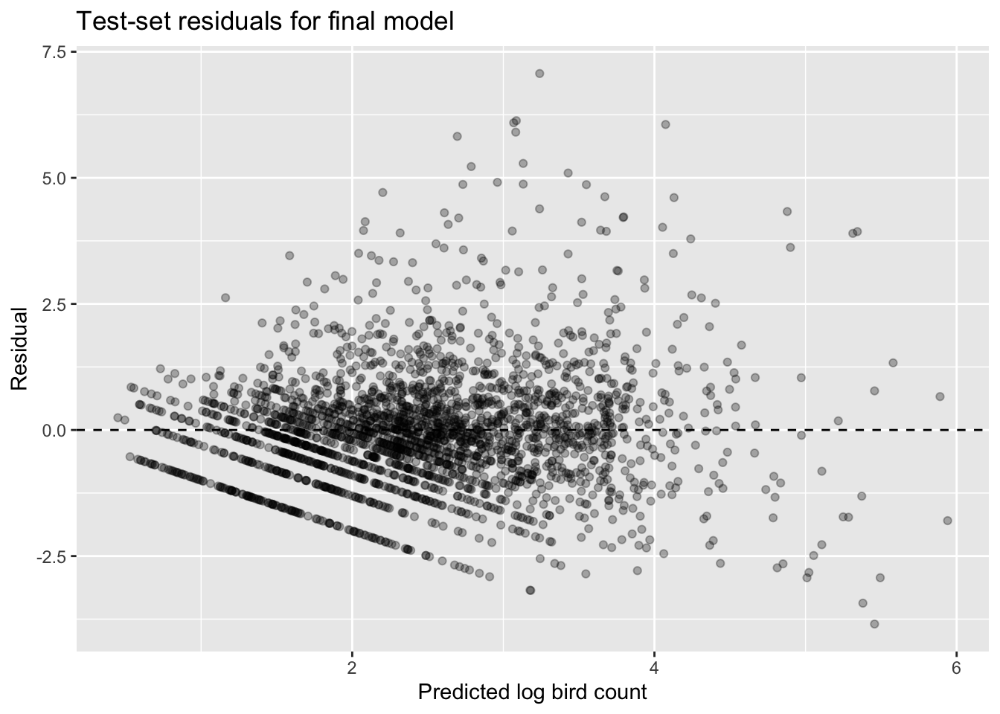{width=672}
:::
:::


# Summary figure

::: {.cell}

```{.r .cell-code}
analysis_df %>%
  filter(census_method == "full") %>%
  group_by(wind_description) %>%
  summarise(
    mean_log_birds = mean(log_total_birds, na.rm = TRUE),
    n = n(),
    .groups = "drop"
  ) %>%
  mutate(wind_description = fct_reorder(wind_description, mean_log_birds)) %>%
  ggplot(aes(x = wind_description, y = mean_log_birds)) +
  geom_col() +
  coord_flip() +
  labs(
    title = "Average bird abundance differs across wind conditions",
    x = "Wind description",
    y = "Mean log(1 + total birds)"
  )
```

::: {.cell-output-display}
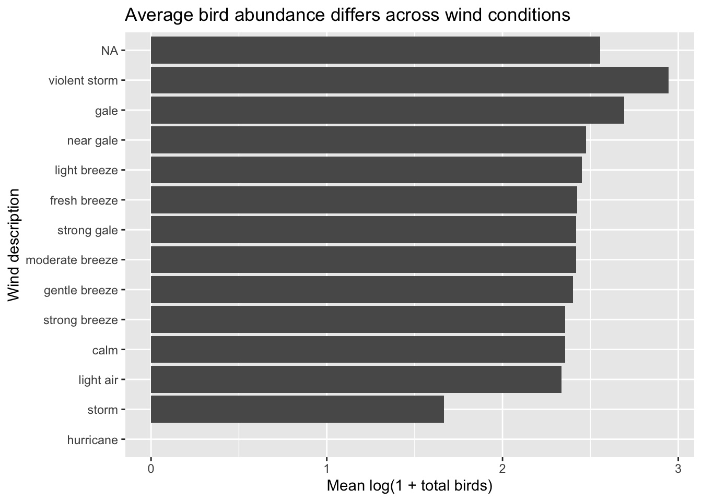{width=672}
:::
:::


I looked at how well environmental conditions and ship activity predict seabird abundance during observation periods. Bird observations were aggregated to the ship-record level, and the outcome was modeled as log(1 + total birds) to address strong skewness.
Exploratory analysis showed that bird abundance varied across ship activities, seasons, and environmental conditions. For example, activities such as trawling were associated with much higher average bird counts, and wind conditions appeared to influence bird abundance . However, many predictors contained missing data, which likely limited model performance.

Model comparisons showed that the random forest outperformed both linear regression and decision tree models. This indicates that the relationships between predictors and seabird abundance are nonlinear and complex. On the test data, the final random forest model achieved an RMSE of ~1.17 and R² of ~0.39 , meaning it explains some of the variation. Residual patterns suggest that there are additional that influence seabird abundance that were not shown in this dataset.

